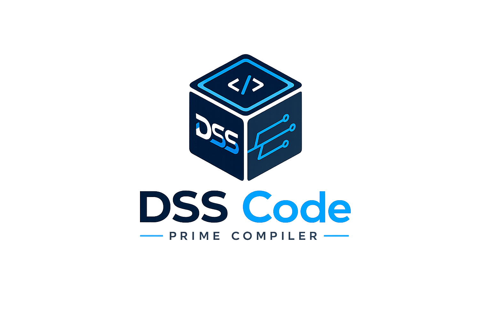

<picture>
  <source media="(prefers-color-scheme: dark)" srcset="img/logo-w.png">
  <source media="(prefers-color-scheme: light)" srcset="img/logo-b.png">
  
</picture>

# DSS Code Prime

**Release binaries for DSS Code Prime — a universal, configurable compiler written in C++.**

---

## About this repository

This repository hosts the **distributable binaries** for DSS Code Prime, the universal compiler engine: define any source language via JSON configuration, compile to any target ISA via JSON configuration — all through a single engine.

The compiler source lives in its own repository. This repo exists to package and publish the built artifacts (executables and libraries) for supported platforms.

> **Status** — Stub. Binary releases and download instructions are coming soon.

## Platforms

DSS Code Prime builds natively on **Windows, Linux, and macOS** across **x86_64 and ARM64**. Released binaries will be published here as they become available.

## License

Licensed under the **Apache License, Version 2.0**. See [LICENSE](./LICENSE) for the full text.
